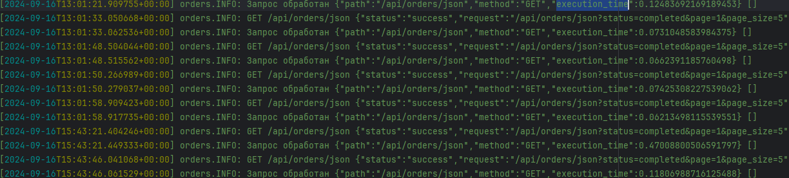

# "Высокопроизводительный" и "Масштабируемый" Сервис на PHP (ну, по крайней мере, я так подумал)

## Описание

Этот проект, который изначально планировался как высокопроизводительный и масштабируемый сервис, написанный на PHP,
стал для меня настоящим приключением. Как же иначе назвать проект, который научил меня самому главному - смирению перед
мощью багов и неожиданными результатами? Иронично, но иногда кажется, что баги работают над увеличением
производительности
и масштабируемости больше, чем я сам. Вот чем занимается мой сервис:

1. **Считывает данные из базы данных MySQL**.
2. **Обрабатывает данные** и сохраняет их в форматах XML и JSON.
3. **Загружает данные** из файлов в форматах XML и JSON.
4. **Реализует API** для получения данных в форматах XML и JSON.
5. **Реализует API** для загрузки данных в форматах XML и JSON.
6. **Обеспечивает мониторинг и логирование** операций.

## Инструкция по установке

---

Клонируйте репозиторий с помощью следующей команды:

```bash
git clone https://github.com/sneaking777/test-task.git
```

> **💡 Перед тем как начать установку проекта, убедитесь, что у вас установлены Docker и Docker Compose. Без этих
инструментов проект не запустится.**

Для запуска проекта необходимо перейти в корень проекта и запустить скрипт `entrypoint.sh`:

```bash
cd /path/to/test-task
./entrypoint.sh
```

Скрипт `entrypoint.sh` запускает следующие сервисы в Docker:

1. [**PHP** - Обрабатывает логику приложения и взаимодействие с другими сервисами.](#php)
2. [**Web Server** - Обеспечивает HTTP-сервер для обслуживания запросов на порт `8081`.](#web-server)
3. [**MySQL Database** - MySQL сервер для хранения данных приложения.](#mysql-database)
4. [**Redis Server** - Кэширование и хранение данных в памяти, работающий на порту `6379`.](#redis-server)
5. [**Composer** - Устанавливает PHP зависимости и автозагрузку.](#composer)

### PHP

Для данного проекта используется PHP 8.3 с установленными расширениями для работы с MySQL и Redis. Сервис выполняет
обработку логики приложения и взаимодействие с другими сервисами.

Dockerfile:

```dockerfile
# Используем базовый образ PHP 8.3 с FPM
FROM php:8.3-fpm

# Устанавливаем зависимости и необходимые расширения для PHP
RUN apt-get update && apt-get install -y \
    libpq-dev \
    libzip-dev \
    zip \
    unzip \
    && docker-php-ext-install pdo pdo_mysql

# Установите расширение Redis
RUN pecl install redis && docker-php-ext-enable redis
```

### Web Server

Обеспечивает HTTP-сервер для обслуживания запросов на порт `8081`. Это позволяет пользователям взаимодействовать с
сервисом через его API.

#### Конфигурация Nginx 

    server {
        listen 80;
        index index.php index.html;
        server_name localhost;
        error_log /var/log/nginx/error.log;
        access_log /var/log/nginx/access.log;
        root /var/www/public;
        client_max_body_size 100M;
    
        location / {
            try_files $uri $uri/ /index.php?$query_string;
        }
    
        location ~ \.php$ {
            try_files $uri =404;
            fastcgi_split_path_info ^(.+\.php)(/.+)$;
            fastcgi_pass php:9000;
            fastcgi_index index.php;
            include fastcgi_params;
            fastcgi_param SCRIPT_FILENAME $document_root$fastcgi_script_name;
            fastcgi_param PATH_INFO $fastcgi_path_info;
        }

    }

#### Dockerfile

```Dockerfile
# Используется последняя версия официального образа nginx из Docker Hub.
FROM nginx:latest

# Копирование файла test_task.conf из текущего контекста сборки (т.е. из директории, где находится этот Dockerfile)
# в специальное место внутри нового образа (/etc/nginx/conf.d/default.conf).
# Файл будет использоваться в качестве конфигурации сервера nginx.
COPY test_task.conf /etc/nginx/conf.d/default.conf
```

### MySQL Database

MySQL сервер используется для хранения данных приложения. Сервис считывает данные из базы данных MySQL, обрабатывает их
и сохраняет в различных форматах.

#### Dockerfile

```dockerfile
# Указываем базовый образ, который мы будем использовать.
# Здесь используется самый последний образ MySQL с Docker Hub.
FROM mysql:latest

# Копируем файл инициализации базы данных в контейнер.
# Предполагается, что у вас есть файл с SQL-скриптами для инициализации базы данных.
COPY init_db.sql /docker-entrypoint-initdb.d/
```

#### Эти переменные прописываются в Docker Compose файле для сервиса
`mysql-server` и могут быть изменены при необходимости.

#### Dockerfile

```dockerfile
# Указываем базовый образ, который мы будем использовать.
# Здесь используется самый последний образ MySQL с Docker Hub.
FROM mysql:latest

# Копируем файл инициализации базы данных в контейнер.
# Предполагается, что у вас есть файл с SQL-скриптами для инициализации базы данных.
COPY init_db.sql /docker-entrypoint-initdb.d/
```

#### Эти переменные прописываются в Docker Compose файле для сервиса
`mysql-server` и могут быть изменены при необходимости.

```
ENV MYSQL_DATABASE=test_task
ENV MYSQL_USER=alex
ENV MYSQL_PASSWORD=123
ENV MYSQL_ROOT_PASSWORD=root
```

#### Создание таблицы заказов также осуществляется посредством сервиса MySQL Database. Скрипт на создание таблицы запускается автоматически:

```mysql
CREATE TABLE orders
(
    order_id    INT PRIMARY KEY AUTO_INCREMENT COMMENT 'Уникальный автоинкрементный идентификатор для каждого заказа',
    customer_id INT            NOT NULL COMMENT 'Идентификатор клиента, разместившего заказ',
    order_date  TIMESTAMP      NOT NULL COMMENT 'Дата и время размещения заказа',
    status      VARCHAR(50)    NOT NULL COMMENT 'Статус заказа (например, ''в ожидании'', ''завершен'')',
    total       DECIMAL(10, 2) NOT NULL COMMENT 'Общая сумма заказа',
    created_at  TIMESTAMP      NOT NULL COMMENT 'Временная отметка создания записи заказа',
    updated_at  TIMESTAMP      NULL COMMENT 'Временная отметка последнего обновления записи заказа',
    INDEX idx_customer_id (customer_id)
)
    COMMENT
        = 'Таблица для хранения информации о заказах'
    ENGINE = InnoDB
    DEFAULT CHARSET = utf8mb4;
```

### Redis Server

Redis сервер используется для кэширования и хранения данных в памяти, что позволяет ускорить доступ к часто
запрашиваемым данным. Работает на порту `6379`.

> **💡 Примечание:** пример кэширования данных можно посмотреть в приложении в классе [OrdersService](./src/App/Services/OrdersService.php) в методе
`getOrders`, который выполняет
> получение данных по заказам.

### Composer

Composer отвечает за установку PHP-зависимостей и автозагрузку. Это помогает автоматически загружать необходимые
библиотеки и расширения для проекта, облегчая управление зависимостями и повышая эффективность.

Для данного приложения Composer установит следующие библиотеки:

- `monolog/monolog` для логирования
- `predis/predis` для кеширования

## Мониторинг и логирование

---


Логирование осуществляется посредством библиотеки Monolog. Логируются операции чтения и записи данных. Файл логов
`orders.log` находится по пути `/storage/logs/`. В этом файле в параметре `execution_time` отображается время выполнения
запроса.



## Postman Коллекции

---

Postman коллекции для тестирования API находятся в папке [docs/postman](./docs/postman)

> 💡 **Примечание:** В коллекциях POSTMAN для POST-запросов были созданы пре-скрипты, которые автоматически генерируют
> данные для заказов формата json и xml. По умолчанию генерируется 1000 заказов. Опционально можно менять количество
> генерируемых заказов, меняя значения константы `NUM_ORDERS`. Если в ответе возвращается ошибка 413 Request Entity Too
> Large, необходимо увеличить значение параметра `client_max_body_size` в конфигурации nginx.


> **💬 Примечание:** Сервис был написан практически на голом PHP, будто в гараже, но я старался соблюдать PSR стандарты.

## Заключение

---

Сервис был написан практически на голом PHP, будто в гараже, но я старался соблюдать PSR стандарты. А что? Немного
порядка еще никому не мешало, верно? 😄
